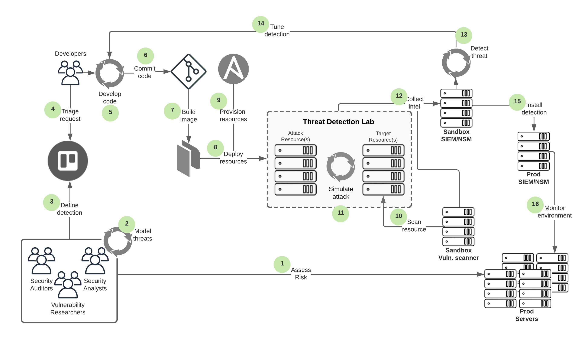
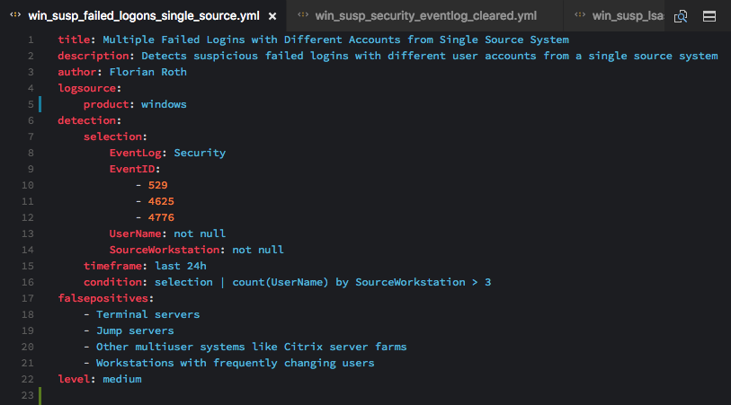
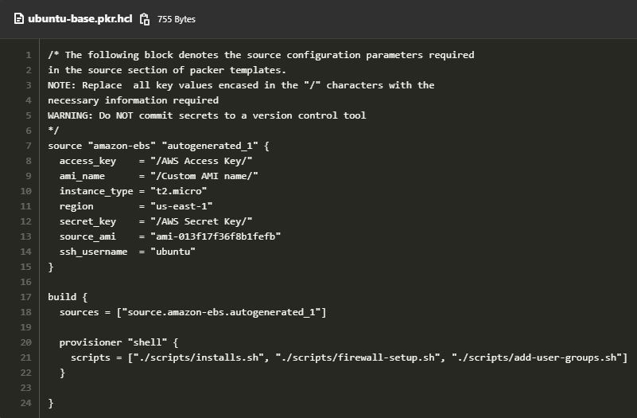
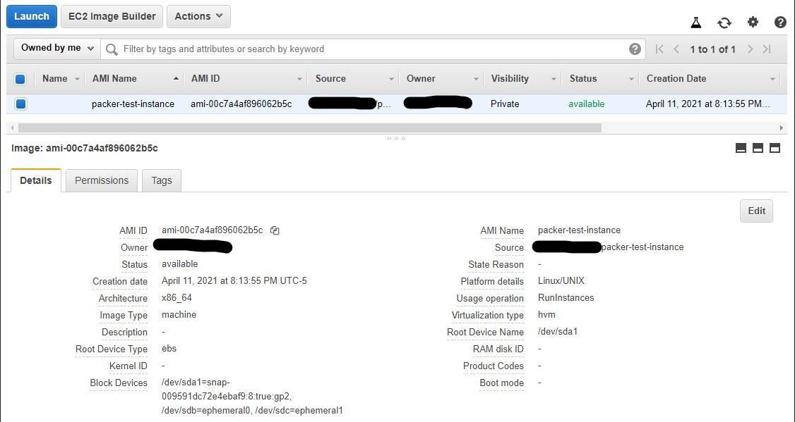
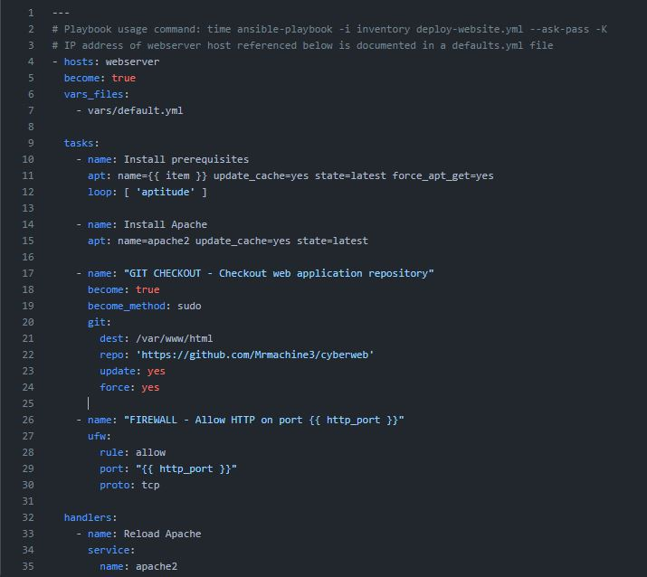

# Detections as Code: DevOps pipelines for Threat Hunting
In industries where speed to market is vital to the success of a business, many software development teams have adopted the mindset of DevOps and agile frameworks to deliver the next best feature set to end users as frequently as possible. The purpose is to give end-users/customers the best experience with using a particular software product. This speed of delivery is accomplished as a result of the continuous collaboration of previously siloed development teams and operations teams. With the trend of organizations moving to the cloud and virtualizing their on-premise workloads in either private clouds or public clouds, infrastructure-as-code (IAC) has become an emerging trend in many organizations that are pursuing avenues to quickly orchestrate computing, networking, and storage resources to meet the demands of their buiness stakeholders and the fast paced objectives of DevOps. With these concepts in mind, consider the possibility of continuously delivering feature sets to end users in the form of security threat detections, or rather continuously deploying signature-based or heuristics-based rules to production environments that have been tested in sandbox environments to successfully detect and/or prevent specific cyber threats or attacks that may be launched against an organization. Detections-as-code is a concept that will be described in greater detail within this research paper and will outline basic examples of what tooling and techniques are typically required to orchestrate these types of development efforts as they relate to and benefit an organization's workforce.

Firstly, it is important to define a few key concepts relevant to the area of IT Governance, Risk, and Compliance (IT GRC), specifically exercises known as threat modeling, vulnerability assessments, and risk assessments. A combination of these key security components will aid an organization in effectively designing a framework to identify potential threats, uncover and address vulnerabilities within an organization's environment, and reduce risk to business processes in order to prevent financial losses to an organization. These three security components can help an organization improve their security posture, as well as help with the development of organizational policies, procedures and standards for compliance with regulatory authorities. Threat modeling is an exercise intended to help identify potentially harmful incidents or scenarios that may be faced in a data center environment, or on software and hardware systems used by end-users. Vulnerability assessments are exercises intended to identify known weaknesses present in an enterprise IT environment, specifically within a software technology stack. Risk assessments are exercises intended to define the potential likelihood and impact of exploited threats through known vulnerabilities, which can subsequently be translated into values representing an organization's potential for financial loss on an annual basis.

The following diagram and process outline describes the various sub-processes that are involved in the overall threat detection engineering process:



## Threat Detection Engineering Process
1. Assess enterprise IT environment risks 
2. Conduct threat modeling exercises to determine potential threats in enterprise IT environments
3. Submit threat detection requests
4. Prioritize threat detection requests
5. Develop detections-as-code
   - Collect sample event logs and packet captures for testing
   - Compile detections for compatibility with SIEM systems
   - Develop and execute unit tests
   - Develop and execute API calls
   - Write and test infrastructure-as-code
   - Write documentation
6. Commit code to git repositories
7. Invoke Hashicorp Packer to build and initialize VM images according to server or workstation standards
8. Deploy resources to a sandboxed **Threat Detection Lab** environment using automation tools 
9. Provision resources with Ansible and apply necessary roles
    - Harden image to organization baseline standards
    - Benchmark resource security compliance levels to minimum CIS standards
    - Validate log forwarding agents are deployed and beaconing back to central SIEM
    - Validate virtual network sensors are deployed, inspecting, and logging network traffic
10. Scan **Threat Detection Lab** environment
    - Enumerate and map the network with NMAP
    - Scan environment for alignment to SCAP security policy compliance
    - Scan environment for vulnerabilities
11. Simulate attacks against **Threat Detection Lab** target infrastructure resources
12. Collect endpoint log events and alternate threat intelligence
13. Detect simulated threats
14. Tune SIEM detection rule
    - Configure action handlers through automated incident response runbooks
    - Add valid endpoint exceptions
    - Validate findings and fidelity of threat detection
15. Install detections on production SIEM/NSM systems
16. Operationalize detection alerts and initiate threat hunting campaigns against environments

In order to execute an effective threat detection engineering program within an organization, it is critical to initiate this process with a consistent collaborative effort involving various teams and business stakeholders, in order to evaluate an enterprise's IT environment from different perspectives. Typically an organization may have an internal audit or risk management team responsible for evaluating an organizations control structure or policies and procedures for proper risk management for financially relevant systems, or critical IT assets involved in achieving business objectives. These teams can help identify gaps or weaknesses in financial and operational business processes and any controls being executed by the organization to maintain the integrity of data produced by the organization. Additionally, business process analysts, security operations analysts, systems architects/engineers would help identify gaps or weaknesses in procedures, standards, controls, and IT resources being operated through the development, deployment, and management of an enterprise's IT environments.

Teams might leverage the NIST framework, PCI DSS, or Sarbanes-Oxley to identify the financial, operational, and IT security controls required to remain in compliance with regulatory authorities, yet more technical teams may leverage frameworks like STRIDE, OCTAVE, or DREAD to perform threat modeling exercises on individual components of a technology stack that represents an organizations key enterprise resource planning (ERP), customer relationship management (CRM), or flagship web application. Specifically, the STRIDE and OCTAVE models seek to evaluate risks for each component making up the entire software and hardware technology solution. These frameworks focus primarily on how malicious actors can jeopardize the confidentiality, integrity, and availability of the application data (Microsoft, 2009). The OCTAVE model seems best suited for an iterativeapproach to threat modeling that complements the agile development cycle of detections-as-code, since the first phase generally identifies the critical assets, defines the necessary baseline security requirements, and identifies the most notable threats to the identified critical assets. After various iterations of a detection development sprint, an organization can advance to subsequent phases for identifying specific vulnerabilities and defining policies and best practices for prioritzing and mitigating the risk (EC-Council, 2020).

Depending on the adoption of whichever framework is used to assess risk or model threat scenarios, key business stakeholders and security assessors alike should define the type of detections their teams should be responsible for monitoring and responding to, including the definition of specific threshholds of acceptable metrics representing normal behavior, as well as abnormal indicators that should be evaluated and responded to by the responsible teams. More important than defining the detections as a result of the risk assessment and threat modeling exercises, is to identify the appropriate data sources that will yield the necessary insights to trigger the detections being requested.

For example, in scenarios where an organization is susceptible to insider threats where users can exfiltrate confidential business information through emails, there must be a reliable source of information available to provide insights into the data exfiltration activity. Commonly, data loss prevention (DLP) systems and email security gateways are implemented to monitor and filter all inbound and outbound employee email traffic. If the data is not available for consumption by large scale data processing tools such as security information and event management (SIEM) systems, then the detection request may not rank as high of a priority to be developed by the threat detection engineering/security operations team. However, much like software product feature requests, many teams may use tracker tool to manage the status of requests to determine if there are any dependencies that may be blocking the development of the feature requests, in this case the availability of email metadata or DLP logs. These types of tracking tools can help identify large development efforts representing epics and user stories that can subsequently be traced back to threat scenarios and larger risk assessments. Ultimately these project planning tools can help teams triage requests and allocate necessary resources to write detection rules, develop infrastructure-as-code (IaC) to orchestrate the provisioning of infrastructure resources required to simulate cyber attacks in a sandboxed environment and test the fidelity of threat detections. 

When considering the topic of developing detections-as-code, this can take many different forms depending on the maturity of a team's DevOps process adoption and also the capabilities of their security analysis tools. For example, security operations centers (SOCs) use many different tools to aid in the overall monitoring of entire enterprise environments, including SIEM solutions, endpoint monitoring agents, network security monitoring systems used to invoke automated remediation procedures on impacted systems. SIEM solutions are scalable systems that aggregate log data from many disparate source systems. Endpoint detection and response (EDR) tools are platforms that monitor operational behavior of systems in order to generate alerts to teams of malicious or abnormal behaviors. EDR tools typically require agent software to be installed on workstations, which monitor executed programs, processes, network activities, filesystem changes, and system performance metrics. EDR agents subsequently forward observed data to a centralized platforms that correlate system information from workstations and distributes alerts to a paging services to activate an IR action. While EDR agents monitor host-based network activity, network sensors distributed amongst data center infrastructure, typical of network security monitoring (NSM) platforms, monitor network connection volumes to external locations, volumes of bytes per packet being transferred beyond internal network boundaries, or inspect packet payload through deep network protocol analysis to determine if packets contain abnormal or malicous artifacts. The capabilities of these various tools typically expose application programming interfaces (APIs) that allow developers to interact with the management interfaces of these tools through programmatic methods, including the creation of conditions to apply against the context being monitored. Furthermore, advances in network automation enable developers to manage network infrastructure programmatically by accessing the management console and defining new routes, network segments, or firewall rules, for example, to be propagated to neighboring appliances. These examples of automated activities can help prevent content from specific IPs or content matching a certain file hash. Since many of these tools are now being manufactured with software that exposes APIs, developers can create programs that enable communication between EDR, SIEM, and NSM systems, which ultimately normalizes the method in which data can be consumed and processed by the security tools to achieve efficiencies necessary for the automation of seemingly complex, decentralized security monitoring and analysis tools.

Two tools briefly referenced by concept in the section above function as an open-sourced SIEM and NSM, called the Elastic stack and Zeek, respectively. These tools are capable of supporting detections-as-code, which can be developed by security analysts and stored in version control, source code management systems such as git. The Elastic stack is composed of four main components, Beats, Logstash, Elasticsearch, and Kibana.


The Beats component is simply a program deployed to an endpoint with a basic configuration file that informs the underlying background process where the log files are stored, their basic file composition, and the destination that the logs should be forwarded to. The Logstash component of the Elastic stack includes more complex rules for parsing log data and mapping fields to a template for indexing into the Elasticsearch storage and indexing backend. Specifically, Logstash has configuration files that include three main sections: inputs, filters, and outputs. The input section of the configuration file, instructs the Logstash program what it should expect as an input to it's process, in this case data being forwarded by Beats agents. The next section of a configuration file typically includes a complex series of filters that must be applied to the raw logs to transform, and enrich the data to yield actionable intelligence. Finally the last section of a configuration file includes an output section that denotes the destination IPaddresses or hostnames of the elasticsearch nodes that will index, and store the parsed log data, according to a specified indexing field mapping template. The final component in the Elastic stack is Kibana, which is the frontend graphical user interface that enables analysts to search through timeseries data by writing search queries in order to identify patterns in the log data collected. Since many SIEM platforms exist and have a slightly different search query syntax, a project was developed and open-sourced on Github called Sigma, which generalizes the formatting of threat signatures, and can subsequently convert signatures into a multiple versions of a syntax compatible with the search query languages of different SIEM solutions and log processing tools. For example a threat signature for multiple failed login attempts from a single host can be documented in a text file, and can subsequently be converted to the specific search query syntax compatible with a specific SIEM. Below is an example data structure that codifies the threat into a YAML file structure: 



The following command line interface (CLI) entry uses the Sigma program to convert the threat detection signature, defined in the "***rules/windows/win_susp_failed_logons_single_source.yml***" file, into the ***es-dsl*** (Elasticsearch domain-specific language) format that aligns to the "***~/windows-security.yml***" data mapping configuration file. 

```bash
tools/sigmac -t es-dsl -c ~/windows-security.yml rules/windows/win_susp_failed_logons_single_source.yml
```

Once the threat detection rule has been developed, best practices should include performing unit tests on the source code. Unit tests may include processes referred to as linting, which invokes a program that parses files and validates that the text meets the syntax requirements. If necessary, source code files may need to reference specific environment variables, in this case, additional functions may need to be developed to programmatically access APIs from IP address management (IPAM) systems or configuration management databases (CMDBs) to retrieve IP addresses, hostnames, or other key environment variable data of target resources. These variables can be parameterized within the source code files and the appropriate variables can be substituted when tests are executed through continuous integration, development, deployment (CI/CD/CD) pipelines as the code is tested in development, testing, and quality assurance environments prior to being deployed to production environments. 

As for NSM tools, a popular solution called Zeek is comprised of a few key components including taps, or sensor nodes, placed at strategic points of a network to copy the live inbound and outbound packet streams into a stream of packets available for further inspection by worker nodes. The copied packet stream is load-balanced and split into different streams that are analyzed by the worker nodes, responsible for deconstructing packets using network protocol analyzers, similar to those found in software like Wireshark, tshark, or tcpdump. The worker nores write log files of different topics that essentially transcribe packet data into event logs that are forwarded to a manager node, or alternatively, a separate logger node. Generally, a few of the most common log types produced by Zeek worker nodes include the following:

- conn.log - connection logs that includes event data for packets representing stateful protocols like TCP.
- dns.log - domain name system logs that includes event data for packets concerning domain name resolution processes
- http.log - hypertext transfer protocol (HTTP) logs include event data for packets containing clear-text HTTP traffic or encrypted HTTPS traffic
- files.log - event data for packets representing the transmission of payloads, such as files across the network, such as the file transfer protocol 
- ssl.log - secure socket layer logs include event data for packets contained decrypted payloads for protocols that utilize the Transport Layer Security (TLS) protocol
- ssh.log - secure shell logs include event data for packets representing network conversations between clients and servers using remote command-line connections
- dhcp.log - dynamic host configuration protocol (DHCP) logs include event data for IP address leasing and provisioning performed by DHCP servers in networks
- weird.log - includes event data consisting of various random stuff where analyzers ran into trouble understanding the traffic in terms of their protocols
- notice.log - includes event data consisting of situations explicitly detected and reported by Zeek scripts as inspection-worthy
- capture_loss.log - includes event data of missing traffic based on the analysis of TCP sequence numbers
- reporter.log - includes event data reporting internal warnings and errors

In addition to the pre-built network protocol analyzers utilized by the Zeek worker nodes, the software also includes support for an event-driven scripting language that extends the funcationality of the network monitoring solution (Amann et al., 2021). Similar to how signature-based intrusion detection systems (IDS), use a pre-built set of conditions that are applied to network traffic to trigger alerts for specific file hashes, URLs, IP addresses, or hostnames, Zeek scripts define the order of operations in which the event protocol analyzers inspect the packet details through complex conditional statements in order to log specific event data. As with threat detections, Zeek scripts can also be tested within the threat detection lab environment by deploying custom scripts as extensible Zeek plugins that can be utilized by deployed worker nodes.

As indicated in the previous sections, often times many different environments are built in order to segment the different types of activities being performed. While it may be simple to manage less resources and possibly only leverage a local development environment and a production environment, there is a significant increase in risk if the same production environment is used to test threat detections or any other type of source code. This can trigger false alerts for security analysts, or possibly disrupt the performance and availability of the production environment if simulated attacks are executed against the environment. As a solution to this problem and associated risks, production environment have been typically replicated in a smaller scale environments which emulate an enterprise production environment. For example resources, such as web servers, databases, routers, or firewalls, may be segmented onto different networks and have a very limited list of users authorized to each of the resources. However, despite having multiple environments with which to test the fidelity of the detection rules, another problem surfaces for operations personnel in terms of system administration in that teams now need to maintain another different set of environments that contain many moving parts, from an infrastructure perspective. The solution to this particular problem is through the definition of infrastrcuture resources through code in the form of Hashicorp Packer configuration files. These files codify the parameters necessary to build virtual machine images. Coupled withthe automated provisioning technology, such as Ansible, infrastructure can be deployed and administered through repeatable actions known as playbooks. Specifically, the Packer solution ensures that virtual machines built in any environment use the same "golden image" of a server's operating system and any layered on enterprise-relevant configurations, as a template with which to deploy a base server. Further administrative actions can be automated and executed against the newly provisioned server through Ansible playbooks to execute compliance tasks such as hardening the server, or adding authorized users. Below is an example of a Hashicorp Packer configuration file for an Ubuntu 18.04 LTS Linux server image initialized in the Amazon AWS cloud, with references to shell scripts that are executed within the temporarily deployed EC2 instance during the Packer build process:



As described above, with all source code files, it is important to validate the configuration code syntax by running a linter on the target files. The following command should be invoked using the built-in Packer binary to consistently check the formatting of the Packer configuration file, in this case `packer validate ubuntu-base.pkr.hcl`. The relative path of the packer configuration file is used and an output of the command will indicate if there are any code syntax errors. Once the validation is complete, the following command must be invoked to build the image file in Amazon AWS' image registry and simultaneously writes the terminal output to a build log file to log the build actions taking place:

```bash
packer build ubuntu-base.json | tee -a build-$(date +"%m%d%Y-%H%M%S").log
```

As shown in the screenshot below, a new virtual machine image file, built by Packer, is registered and stored in AWS for use as a base template in subsequent infrastructure provisioning tasks. Such tasks can include more complex dependencies that should not be built using a Packer configuration file, but rather provisioned using Ansible playbooks consisting of tasks corresponding to the role a server will have as it is being deployed into its target environment. 



For example, if a basic webserver is required to host a web application, an Ansible playbook can be executed to automate changes on a running instance of Ubuntu 18.04 LTS VM, install the compatible Apache web server software, clone a git repository containing the web application source code, opening secure web traffic port by updating host-based firewall rules, and restart the webserver to load the web application. Below is an excerpt from an Ansible playbook documenting the idempotent tasks performed by the automation software to deploy the web application on the target web server. The Hashicorp Packer and Ansible tools can similarly be extended to build golden images of supported enterprise-grade operating systems for both Windows and Unix/Linux servers and end-user workstations, which can be hardened through the use of pre-existing scripts that enable security controls defined by security engineers and IT GRC analysts. Additionally, Ansible playbooks can be utilized to provision multiple resources to build an enterprise production and testing environment, that serves as a foundation for simulating cyber attacks in a segmented, isolated environment for threat detection engineering. 



As with all development projects, any associated configuration YAML files, infrastructure-as-code, and documentation must be committed to a version controlled git repository so other developers can contribute code to the git repository. In efforts to automate the deployment of necessary infrastructure resources required for a Threat Detection lab environment, CI/CD/CD pipelines can be defined to automatically invoke the building of new images when changes to Packer configuration files are committed and pushed to git repositories. Similarly, on a weekly basis during non-standard working hours, an existing threat detection lab can be rebuilt to refresh and reset the state of the environment, to apply new compliance policies, to scan hosts for newly identified vulnerabilities, or to validate/configure log forwarding agents and EDR agents are working as expected within the environment. Once resources are deployed, or rebuilt, automated penetration tests can be launched against the target resources using tools, such as OWASP Zed Attack Proxy (ZAP), or Burpsuite. In the example of the deployed application hosted on the Apache webserver, a number of automated cyber attacks can be launched against the web application, including enumerating all domains, sub-domains, and APIs to identify exposed sensitive data, brute force password attacks against the web application login or authentication pages, and command/SQL injection attacks against the database or web service back-end infrastructure components to name a few. While automated attacks can be scheduled to run indpendently without any intervention, manual attacks against the resources can be executed by the organization's own red team or external pentesters, while simultaneously helping train blue team analysts in responding to any alerts set off by the malicious behavior being detected by EDR, SIEM, and NSM systems. 

A popular open source project called Detection Lab has been developed to achieve the objective of deploying infrastructure defined through code with all the necessary logging and security tooling required to streamline the work of enterprise defenders (Long, 2021). This project was developed to simplify testing and analyses performed by defensive security researchers and the lab environment consists of a few Windows machines representing a domain controller, a Windows 10 workstation, and an event collector/forwarder. Each of the Windows systems has a pre-installed monitoring service called Sysmon, OSquery, and a Velociraptor agent. A fourth machine runs Ubuntu Linux and serves as the log aggregation server hosting Splunk, a common SIEM, and also running Suricata and Zeek for network security monitoring. The Sysmon service, and a Velociraptor agent runs on each windows device as an EDR agent that analyzes, monitors, logs, and collects system activity (Russinovich & Garnier, 2021). Velociraptor runs as a client-service program and the binary collects artifacts, specifically artifacts such as a registry hives common to Windows operating systems. The artifacts are subsequently parsed into a format that can be searched with a syntax similar to SQL. The results are then transmitted to a central server that aggregates the endpoint information for broader pattern detection and investigation. Finally, OSquery is a tool that can abstract endpoint system data in a format that can be queried with SQL-like statements. The query results are aggregated and written to logs that capture the state of an endpoint as they change over time. 

Since the Detection Lab project was developed primarily with security defenders in mind, two other common projects seen to benefit red teams, or penetration testers, are Atomic Red Team and Caldera. While these two project don't necessarily orchestrate the building and deployment of infrastructure resources in an automated manner, the projects excel in executing automated attack simulations at defined targets. For example, the Atomic Red Team git repository consists of a library of limited scope tests that security teams can execute against their sandbox environment in order to validate the completeness and effectiveness of their security controls. Similarly, Caldera is a project that formulates guides that align to a framework called MITRE ATT&CK for mapping adversarial tactics, tools, and procedures observed in historical cyber attacks. The Caldera project offers a blueprint to easily automate adversarial attacks against infrastructure in order to help security defenders respond to simulated security incidents (MITRE Corp., 2020).

The purpose of deploying and provisioning resources within a threat detection lab in a sandboxed environment is to isolate intelligence data generated from simulation attacks from production environment data; therefore, many of the tools highlighted in the previous sections must transmit all threat intelligence and EDR data to a secondary instance of a SIEM and NSM in order to validate the accuracy of the detection. Thorough testing of any detection rule and the identification of more obscure indicators of compromise can aid in refining, or tuning, the detection in order to reduce the number of false positives generated once the detection is deployed to the production environment SIEM and NSM system. The cyle of developing detections, testing them, tuning them, and deploying them ensures that at the end of the day, any real attack has a greater chance of being identified earlier in an attack's lifecycle. 

As described in this research paper, security alerting and threat detections can be closely compared to features of software products, specifically in the manner in which the software is developed and how aligned the process is with an agile DevOps methodology. Through numerous code iterations, provisioning of infrastructure resources, and automated attack simulations, accurate signature and heuristics-based threat detections, can be continuously tested and delivered to production environments at a quicker pace. While speed to market is irrelevant with this software code product, the value to an end-user is immediately apparent in how successful a security operations teams is able to detect and/or prevent specific cyber threats or attacks that may be launched against an organization without jeopardizing an end-user, their data, or an organization's IT assets.

# Works Cited
- Amann, J., Bejtlich, R., Dopheide, M., Graner, A., Grashöfer, J., Kreibich, C., Wojtulewicz, T., Bannat Wala, F., Turley, N., Soto, A., Sommer, R., Smoot, S., Siwek, J., Sharma, A., & Leach, T. (2021, May 20). Zeek Documentation. Zeek Documentation - Book of Zeek (v4.0.1). https://docs.zeek.org/en/current/index.html. 
- EC-Council. (2020, December 24). OCTAVE Threat Modeling – All You Need to Know: EC-Council. EC Council Blog. https://blog.eccouncil.org/octave-threat-modeling-all-you-need-to-know/. 
- Long, C. (2021, May 20). Introduction. DetectionLab. https://www.detectionlab.network/introduction/. 
- Microsoft. (2009, November 12). The STRIDE Threat Model. Microsoft Docs. https://docs.microsoft.com/en-us/previous-versions/commerce-server/ee823878(v=cs.20)?redirectedfrom=MSDN. 
- The MITRE Corporation. (2020, August 21). CALDERA™. Caldera. https://www.mitre.org/research/technology-transfer/open-source-software/caldera%E2%84%A2. 
- Russinovich, M., & Garnier, T. (n.d.). Sysmon - Windows Sysinternals. Sysmon - Windows Sysinternals | Microsoft Docs. https://docs.microsoft.com/en-us/sysinternals/downloads/sysmon#:~:text=System%20Monitor%20(Sysmon)%20is%20a,changes%20to%20file%20creation%20time. 
- Welcome to osquery. Using osquery - osqueryd (daemon). (n.d.). https://osquery.readthedocs.io/en/stable/introduction/using-osqueryd/. 
